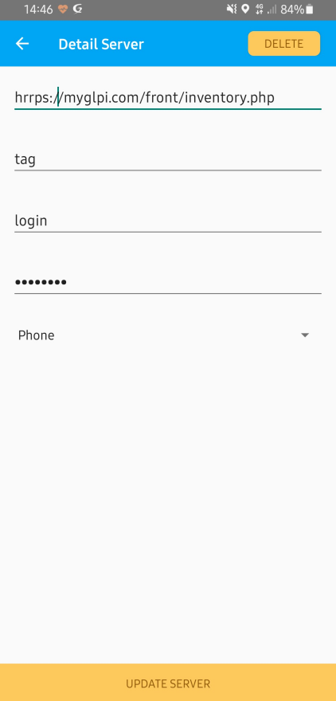
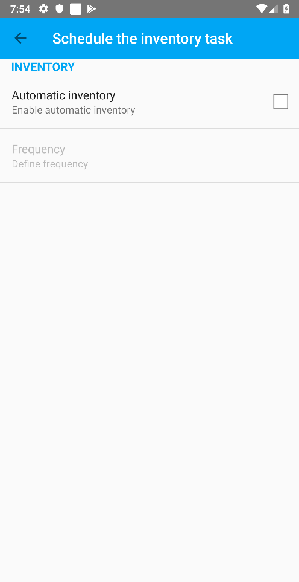

# Inventory Agent for Android


[](https://github.com/glpi-project/android-inventory-agent/blob/develop/LICENSE.md)
[](https://creativecommons.org/licenses/by/4.0/)
[](https://twitter.com/teclib)
[](https://t.me/glpien)
[](http://www.repostatus.org/#active)
[](https://conventionalcommits.org)
[](https://greenkeeper.io)
[](https://github.com/glpi-project/android-inventory-agent/releases)
[](https://circleci.com/gh/glpi-project/android-inventory-agent/)


## Synopsis

The Inventory Agent for Android allows you to collect a complete inventory of your Android device and sent it to your GLPI.

### Data collected

* Account Info
* Accesslog
* Hardware
* User
* Storages
* Operating System
* BIOS
* Memories
* Inputs
* Sensors
* Drives
* CPUs
* Videos
* Cameras
* Networks
* Environments variables
* JVMS
* Softwares
* USB
* Battery
* Controllers
* Videos

### Data type

Now you can choose (from the server information) whether this inventory should create a ```Phone``` or a ```Computer``` on GLPI

## Compatibility Matrix

### GLPI Android Inventory Agent

|GLPI|9.1|9.2+|9.3+|9.4+|9.5+|10.0+|10.0+|10.0+|
|:---|:---:|:---:|:---:|:---:|:---:|:---:|:---:|:---:|
|**GLPI Android Inventory Agent**|1.0.0|1.0.0|1.0.0|1.0.0|1.1.0|1.3.0|1.4.0|1.5.0|
|**Plugin GLPI Agent Config**|1.0|1.0|1.0|1.0|1.1.0|1.2.0|1.2.1|1.2.1|

### Inventory Agent & Android Versions

GLPI Android Inventory Agent is compatible with Android 5 and higher (to Android 13).

## Installation

[](https://play.google.com/store/apps/details?id=org.glpi.inventory.agent) 

Are you having trouble installing our GLPI Android Agent? You can subscribe to our professional support GLPI Network [here](https://services.glpi-network.com).

## Configuring the Agent with an EMM / MDM Tool

The GLPI agent can be deployed/configured from an **MDM** / **EMM** tool

- Samsung Knox
- AirWatch
- InTunes
- MobileIron
- etc.

As long as the **MDM** / **EMM** tool is compatible with [managed configurations](https://developer.android.com/work/managed-configurations), you can configure the GLPI Agent (at deployment or on the fly).

Here is the list of configurable settings:

- **`auto_start_on_boot`** => Run an inventory at startup (`Bool` `true` / `false`)
- **`automatic_inventory`** => Enable automatic inventory (`Bool` `true` / `false`)
- **`frequency`** => Frequency of automatic inventory (`String` `Day` / `Week` / `Month` default `Day`)
- **`server_configuration_list`** => (`Bundle`)
    - **`server_url`** => GLPI server URL (`String`)
    - **`server_tag`** => TAG (`String`)
    - **`server_login`** => Username for basic authentication (`String`)
    - **`server_password`** => Password for basic authentication (`String`)
    - **`server_itemtype`** => Asset type in GLPI (`String` `Computer` / `Phone` default `Computer`)
    - **`server_custom_asset_serial`** => Custom serial number to replace the one generated by the agent (`String`)

## Documentation

We maintain a detailed documentation of the project on the website, check the [How-tos](http://glpi-project.github.io/android-inventory-agent/howtos/) and [Development](http://glpi-project.github.io/android-inventory-agent/) section.

## Screenshots

|    |            |   |
|:-------------:|:-------------:|:-------------:|
|  |      |   |
|  |      |  | 

## Versioning

In order to provide transparency on our release cycle and to maintain backward compatibility, GLPI Android Inventory Agent is maintained under [the Semantic Versioning guidelines](http://semver.org/). We are committed to following and complying with the rules, the best we can.

See [the tags section of our GitHub project](http://github.com/glpi-project/android-inventory-agent/tags) for changelogs for each release version of GLPI Android Inventory Agent. Release announcement posts on [the official GLPI blog](https://glpi-project.org) contain summaries of the most noteworthy changes made in each release.

## Professional Services


The GLPI Network services are available through our [Partner's Network](http://www.teclib-edition.com/en/partners/).
We provide special training, bug fixes with editor subscription, contributions for new features, and more.

Obtain a personalized service experience, associated with benefits and opportunities.

## Contribute

Want to contribute some code, or improve documentation? Excellent! Read up on our guidelines for [contributing](./CONTRIBUTING.md) 

* Open a ticket for each bug so it can be discussed
* Follow [development guidelines](http://glpi-developer-documentation.readthedocs.io/en/latest/plugins/index.html)
* Refer to [GitFlow](http://git-flow.readthedocs.io/) process for branching
* Work on a new branch on your own fork
* Open a PR that will be reviewed by a developer

## Request features

Want to request features? Please contact us [here](https://portal.glpi-network.com/contact-us)

## Copying

* **Name**: [GLPI Android Inventory Agent](https://glpi-project.org/fr/) is a registered trademark of [Teclib](http://www.teclib-edition.com/en/).
* **Code**: you can redistribute it and/or modify
    it under the terms of the GNU General Public License ([GPLv3](https://www.gnu.org/licenses/gpl-3.0.en.html)).
* **Documentation**: released under Attribution 4.0 International ([CC BY 4.0](https://creativecommons.org/licenses/by/4.0/)).
